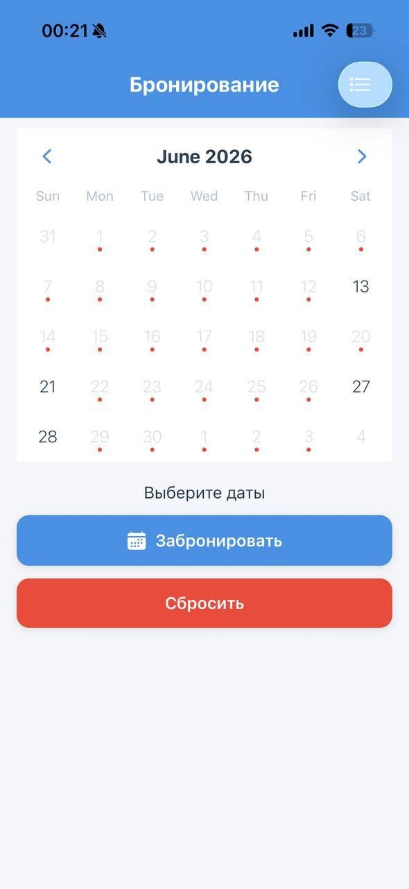
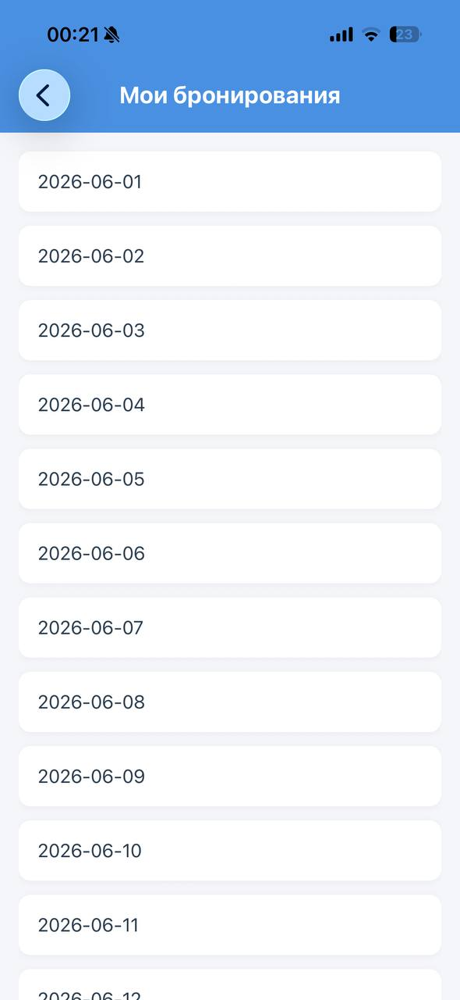

# 📅 Booking App

> Мобильное приложение для выбора и бронирования дат с синхронизацией через сервер.

---

# 📋 Оглавление

1. [📌 Описание](#-описание)
2. [🛠 Используемые технологии](#-используемые-технологии)
3. [📁 Структура проекта](#-структура-проекта)
4. [⚙️ Переменные окружения](#️-переменные-окружения)
5. [🚀 Запуск сервера](#-запуск-сервера)
6. [📱 Запуск мобильного клиента](#-запуск-мобильного-клиента)
7. [📡 API сервера](#-api-сервера)
8. [🧪 Тестирование](#-тестирование)
9. [📦 Зависимости](#-зависимости)
10. [🖼 Скриншоты](#-скриншоты)
11. [📄 Лицензия](#-лицензия)

---

# 📌 Описание

**Booking App** — учебный проект, состоящий из мобильного клиента и сервера для бронирования дат.

### Возможности

* Просмотр календаря
* Выбор диапазона дат
* Отображение занятых дат
* Создание бронирований
* Просмотр списка бронирований
* Синхронизация данных через HTTP API

---

# 🛠 Используемые технологии

## Клиент

| Технология                 | Назначение                       |
| -------------------------- | -------------------------------- |
| React Native (Expo SDK 54) | Разработка мобильного приложения |
| React Navigation           | Навигация между экранами         |
| react-native-calendars     | Календарь                        |
| Expo Vector Icons          | Иконки                           |
| Axios / Fetch API          | Работа с HTTP                    |

## Сервер

| Технология      | Назначение                            |
| --------------- | ------------------------------------- |
| Python 3.12+    | Основной язык                         |
| FastAPI / Flask | Backend                               |
| ngrok           | Публичный доступ к локальному серверу |
| python-dotenv   | Работа с переменными окружения        |

---

# 📁 Структура проекта

```text
booking_app/
├── BookingApp/
│   ├── screens/
│   │   ├── MainScreen.js
│   │   └── BookingsScreen.js
│   ├── assets/
│   ├── App.js
│   ├── app.json
│   ├── package.json
│   └── ...
│
├── server/
│   ├── main.py
│   ├── requirements.txt
│   ├── .env
│   └── .gitignore
│
├── .gitignore
└── README.md
```

---


# 🚀 Запуск сервера

## 1. Создание виртуального окружения

```bash
cd server

python -m venv .venv
```

### Windows

```bash
.venv\Scripts\activate
```

### Linux / macOS

```bash
source .venv/bin/activate
```

## 2. Установка зависимостей

```bash
pip install -r requirements.txt
```

## 3. Запуск сервера

Если используется FastAPI:

```bash
uvicorn main:app --host 0.0.0.0 --port 8000 --reload
```

Сервер будет доступен по адресу:

```text
http://localhost:8000
```

## 4. Публикация через ngrok

В новом терминале выполните:

```bash
ngrok http 8000
```

Пример полученного адреса:

```text
https://abcd-12-34-56.ngrok-free.app
```

## 5. Настройка клиента

Укажите адрес сервера:

```javascript
const API_URL = "https://ваш-ngrok-url.ngrok-free.app";
```

> Не рекомендуется коммитить реальный ngrok URL в репозиторий.

---

# 📱 Запуск мобильного клиента

Перейдите в директорию приложения:

```bash
cd BookingApp
```

Установите зависимости:

```bash
npm install --legacy-peer-deps
```

Запустите Expo:

```bash
npx expo start --tunnel
```

После запуска:

1. Откройте Expo Go.
2. Отсканируйте QR-код.
3. Приложение запустится на устройстве.

---

# 📡 API сервера

## Получение занятых дат

### Запрос

```http
GET /dates
```

### Ответ

```json
{
  "bookedDates": [
    "2026-06-15",
    "2026-06-16",
    "2026-06-20"
  ]
}
```

---

## Создание бронирования

### Запрос

```http
POST /book
```

### Тело запроса

```json
{
  "startDate": "2026-06-25",
  "endDate": "2026-06-27"
}
```

### Успешный ответ

```json
{
  "success": true,
  "message": "Даты успешно забронированы"
}
```

### Ответ с ошибкой

```json
{
  "success": false,
  "message": "Одна или несколько дат уже заняты"
}
```

---

# 🧪 Тестирование

## Получение списка занятых дат

```bash
curl https://ваш-ngrok-url.ngrok-free.app/dates \
  -H "ngrok-skip-browser-warning: 69420"
```

## Создание бронирования

```bash
curl -X POST https://ваш-ngrok-url.ngrok-free.app/book \
  -H "Content-Type: application/json" \
  -H "ngrok-skip-browser-warning: 69420" \
  -d '{"startDate":"2026-07-01","endDate":"2026-07-03"}'
```

---

# 📦 Зависимости

## Backend

```txt
fastapi>=0.115.0
uvicorn>=0.30.0
python-dotenv>=1.0.1
pydantic>=2.9.0
```

## Frontend

```json
{
  "expo": "~54.0.0",
  "react": "~19.1.0",
  "react-native": "0.81.5",
  "react-native-calendars": "^1.1314.0",
  "@react-navigation/native": "^6.1.18",
  "@react-navigation/native-stack": "^6.11.0",
  "react-native-screens": "~3.35.0",
  "react-native-safe-area-context": "~4.12.0"
}
```

---

# 🖼 Скриншоты

### Главный экран


### Мои бронирования


---

# 📄 Лицензия

Проект создан в учебных целях.

Вы можете свободно использовать, изменять и распространять код для обучения и личных проектов.
